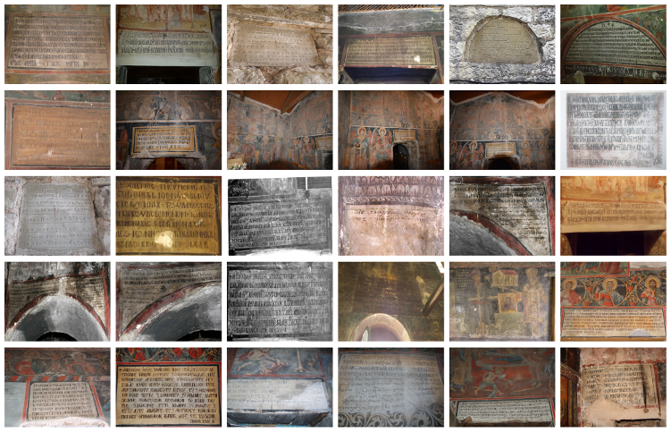
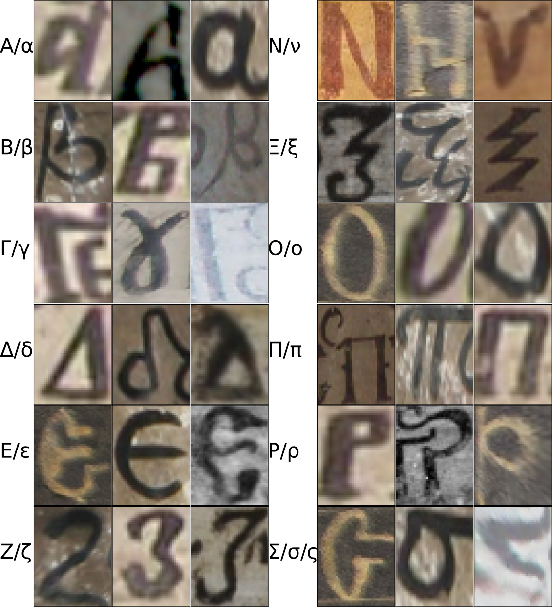
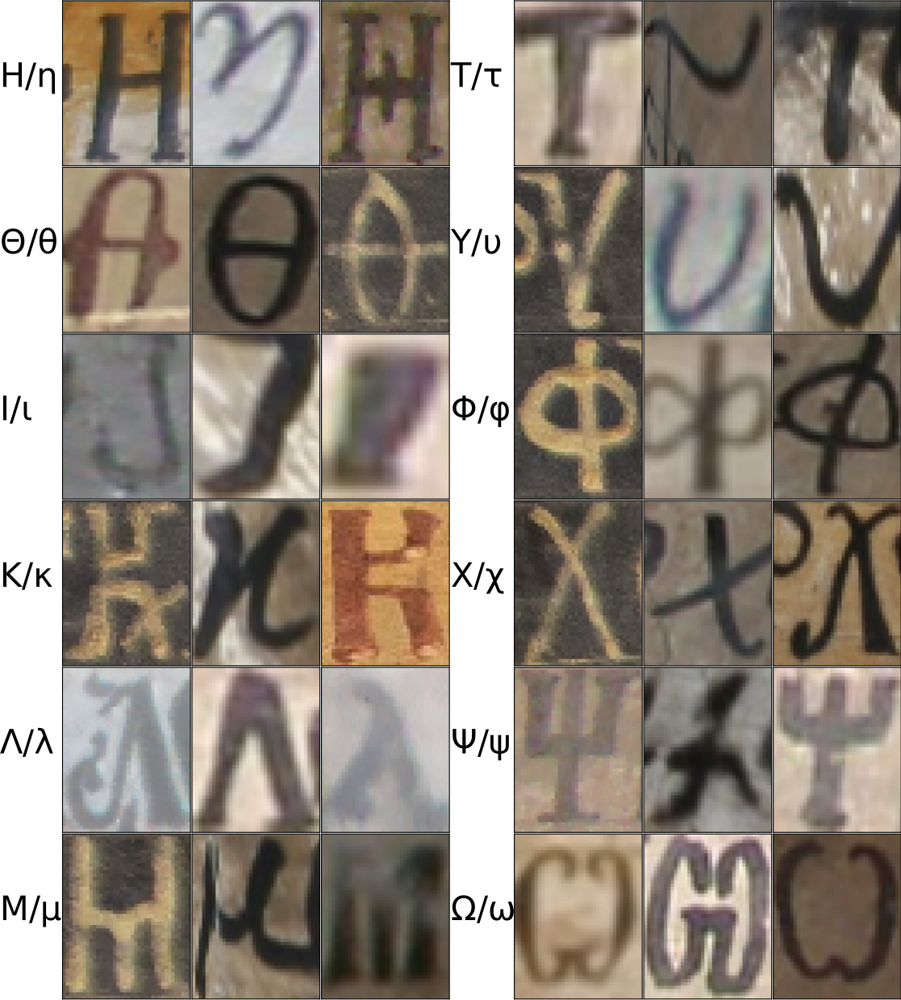
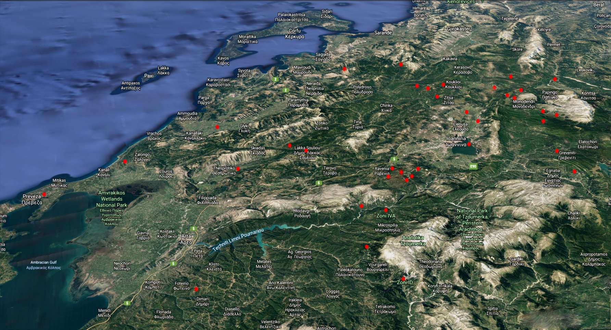
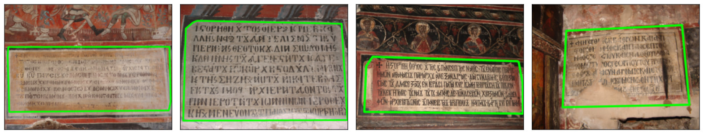
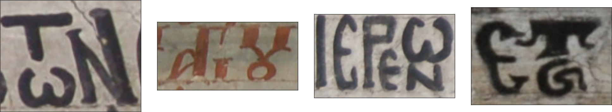
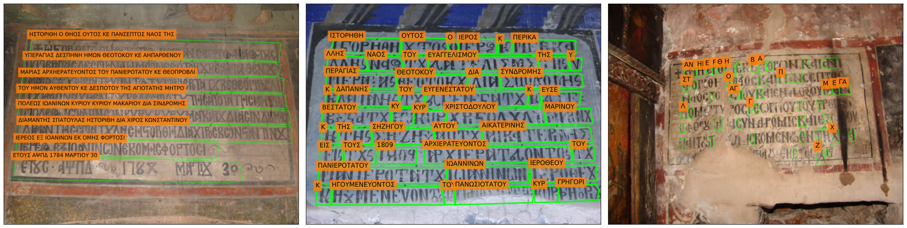
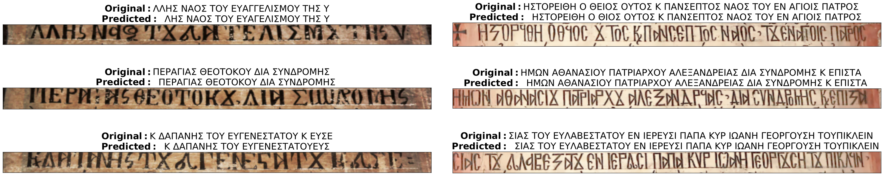
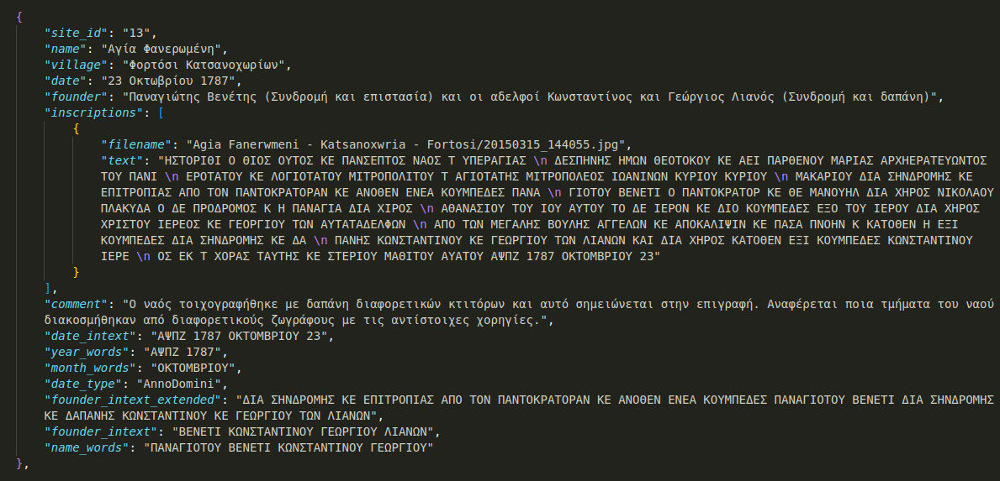

# Bessarion: Medieval Greek Inscriptions on a challenging dataset for Vision and NLP tasks

We present a text and imaging dataset of [Byzantine](https://www.britannica.com/place/Byzantine-Empire)-era Medieval Greek inscriptions, 
suitable as a challenging testbed for Computer Vision and Natural Language Processing tasks.
The lack of sizable related training sets, as well as difficulties related to the historical character and content of the inscriptions
(natural wear of characters, systematic misspellings, etc.)
make for a context where modern resource-hungry techniques are not straightforward to apply.
In the [paper](https://www.cs.uoi.gr/~sfikas/DAS2024-bessarion.pdf), We describe the dataset contents -- images, geometric and text annotation, metadata -- and discuss baselines for three Computer Vision tasks (Inscription Detection, Text Recognition) and one Natural Language Processing task (Word Classification).
    
## About 

### Dataset outline

<p align="center"> 
 <br>
Example images of the dataset, out of a total of 122 images.
Images depict historical donative <a href="https://en.wikipedia.org/wiki/Byzantine-Empire">Byzantine</a> inscriptions, describing lists of the persons or groups
that contributed for the construction of a related site or monument.
The text is written in the <a href="https://en.wikipedia.org/wiki/Greek_language">Greek language</a>.
</p>
<br>

<p align="center"> 
 <br>
Example forms of character images found in the dataset.
We provide annotations in multiple levels; 
there are a total of 504 outlined textlines,
2,776 outlined words and 
10,414 outlined characters.
</p>
<br>

<p align="center"> 
 <br>
Map showing positions of the sites relevant to Bessarion data.
Our dataset comes from a total of 37 sites spanning the region of <a href="https://en.wikipedia.org/wiki/Epirus">Epirus</a>, situated in North-Western <a href="https://en.wikipedia.org/wiki/Greece">Greece</a>.
</p>
<br>

### Inscription detection

<p align="center"> 
 <br>
Example ground-truth annotations for selected samples.
</p>
 <br>


<div align="center">

| **Method**        | **AP**  | **AP<sub>70</sub>** |**AP<sub>50</sub>**  | **Parameter Size** |
|--------------------------|-----------------|----------------------------------|---------------------------------|--------------------------|
| Sparse R-CNN            |  56%       |  82%                        |  63%                       |  105.94 M             |
| Q-GAN + CC              |  37%       |  62%                        |  49%                       |  1.6 M                |

Numerical comparison of baseline detectors. Detection accuracy in terms of mean average precision and average precision at different IoU thresholds is reported. Network sizes are cited for comparison.

</div>


### Text Recognition

<p align="center"> 
 <br>
Examples of recognition challenges posed by the nature of Byzantine text painting.
</p>
 <br>

<p align="center"> 
 <br>
Example of three different types of text annotations.
From left to right: Line-level, word-level, character-level annotation.
</p>
 <br>

<p align="center"> 
 <br>
Example text lines with the ground truth recognition label (Original) 
    and the HTR model one as (Predicted). A WER of $6.1\%$ is achieved using the HTR model of <a href="https://www.cs.uoi.gr/~sfikas/DAS2022-Retsinas-BestpracticesHTR.pdf">[Retsinas et al. 2022]</a>. 
</p>
 <br>

### Word Classification

We are interested in answering:
* which person donated or contributed for the specific monument,
* when was the monument constructed.

Concerning our baseline NLP method, we aim to answer the aforementioned questions via a word classification task
(is this word related to the founder / dating of the monument?)

<p align="center"> 
 <br>
Sample NLP task ground truth file in JSON format.
</p>
 <br>


As medieval Greek is poorly represented in terms of accessible digitized corpora,
we combine a (modern Greek) [BERT](https://arxiv.org/abs/2008.12014) encoder-based model with 
question-specific corpus augmentation methods.
The baseline method achieves a correct classification ratio ranging from 75% to 99%.


## Data

### Imaging data

* Image data + PageXML annotations can be found under the folder ``dataset/image_resources``. Each folder contains data coming from a single location (= village or monastery). Data from the same location, but different (neighbouring) monument, may be contained in a separate subfolder.

### Natural Language data

* Data related to the NLP task includes the full transcription for a number of inscriptions, plus metadata related to the content of each inscription. These are found under folder ``dataset/nlp_resources``.

## Other info

### Historical note

The title of the dataset is an homage to the Greek scholar [Bessarion](https://en.wikipedia.org/wiki/Bessarion).

"*Bessarion (Greek: Βησσαρίων | 2 January 1403 - 18 November 1472) was a Byzantine Greek Renaissance humanist, theologian, Catholic cardinal and one of the famed Greek scholars who contributed to the so-called great revival of letters in the 15th century. He was educated by Gemistus Pletho in Neoplatonic philosophy and later served as the titular Latin Patriarch of Constantinople. He eventually was named a cardinal and was twice considered for the papacy*" (text from wikipedia)
</p>

### Acknowledgments

This dataset has been collected and processed in the context of research project "Bessarion",
funded through the National/EU call "Open Innovation in Culture". You can check the project website [here](https://bessarion.gr/).

### Bessarion project seminar

You can watch the seminar that was held in Arta, Greece, discussing the work carried out for the research project "Bessarion"
[here](https://www.youtube.com/watch?v=YqOKRVbDDfs).

### Paper citation

If you find the dataset useful, please consider citing the [paper](https://www.cs.uoi.gr/~sfikas/DAS2024-bessarion.pdf):

```bibtex
@inproceedings{sfikas2024bessarion,
  title={{B}essarion: {M}edieval {G}reek inscriptions on a challenging dataset for {V}ision and {NLP} tasks},
  author={Sfikas, Giorgos and Dimitrakopoulos, Panagiotis and Retsinas, George and Nikou, Christophoros and Kitsiou, Pinelopi},
  booktitle={International Workshop on Document Analysis Systems},
  pages={393--407},
  year={2024},
  organization={Springer}
}
```
